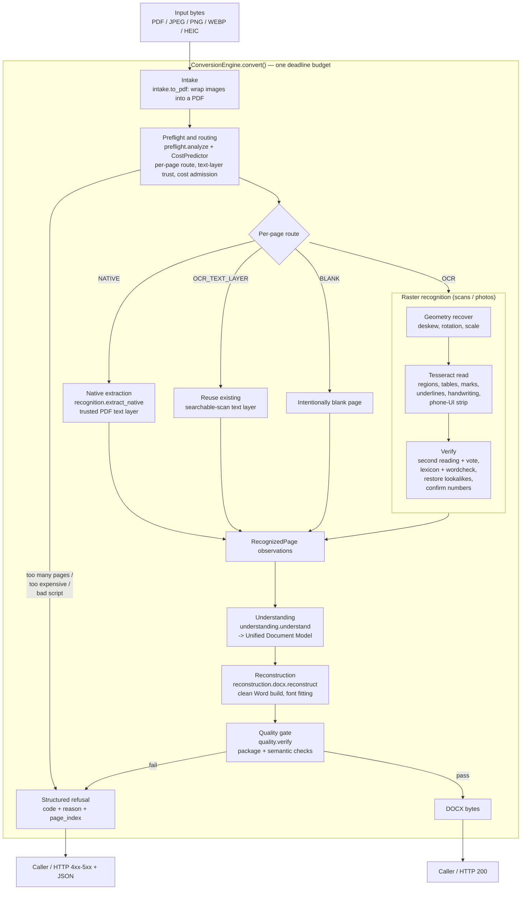
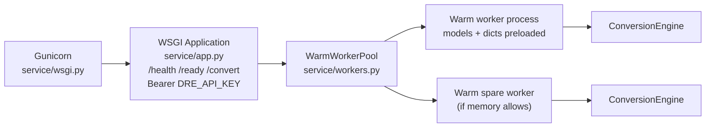

# Document Reconstruction Engine (DRE)

DRE turns a **PDF, scan, or photo of a document into an editable DOCX**. It is a self-contained
module that runs inside the company's larger system: the main program hands it a file and gets back
either a DOCX or a structured refusal.

Its one governing rule: **when it is not confident, it refuses — it never issues a document with
silent errors.** A refusal carries a machine-readable `code` and `reason` so the caller can decide
what to do; a wrong date or a garbled line in an official document is treated as worse than no document.

## Design principles

- **Refuse rather than guess.** Every page is read, verified against dictionaries and a second
  reading, and checked for structure. Anything that cannot be confirmed becomes a refusal with a reason.
- **Fully offline.** Local OCR (Tesseract), local dictionaries (Hunspell ru/kk/uz/en), local fonts.
  No network, no GPU.
- **Deterministic.** The same input produces the same DOCX on any machine running the same image version.
- **Deadline-bounded.** A hard 45 s per-document budget. The engine *predicts* cost up front and
  *re-checks* before each page, so a slow machine refuses early instead of timing out at the end.
- **Cyrillic + Latin, by design.** Tuned for Russian / Kazakh / Uzbek official documents: Uzbek
  Latin↔Cyrillic, Kazakh diacritics, and lookalike-letter confusions are first-class concerns.
  (Because of this, Cyrillic letters, alphabets and dictionaries are *intentional data* throughout
  the source and test fixtures — see "A note on Cyrillic in the source" below.)

## How a conversion flows



The key architectural seam is the **Unified Document Model** (`model.py`): native extraction and raster
OCR both produce `RecognizedPage` observations, and `understanding.py` is the *only* place that turns
those into the model. Reconstruction (`reconstruction/docx.py`) imports neither OCR nor PDF code — it
builds Word purely from the model. That keeps "how we read" and "how we write" independent.

## Serving model



Workers are **warm, process-isolated** so a stuck native/OCR call can be stopped at the deadline, and
each worker is capped by RSS to contain leaks. `resources.py` reads cores and memory *through cgroups*,
so a `--cpus=1 --memory=2g` container plans exactly as much work as it may actually run. `speed.py`
calibrates this machine against a reference laptop core at start-up; that multiplier feeds the cost
admission so projections are honest on a slow server.

## Repository layout

```
src/document_reconstruction/
├─ engine.py            Orchestrator: ConversionEngine.convert(), stage sequencing, budget
├─ intake.py            Normalize input (images -> PDF)
├─ preflight.py         Per-page routing, text-layer trust, cost admission (CostPredictor, PagePlan)
├─ model.py             Unified Document Model (Box, Page, Paragraph, Table, Cell, Graphic, InlineRun)
├─ understanding.py     RecognizedPage observations -> Unified Document Model
├─ quality.py           verify(): DOCX package + semantic QA gate
├─ speed.py             Machine-speed calibration vs the reference core
├─ resources.py         cgroup-aware cores/memory -> workers, concurrency, page threads
├─ config.py            Settings from environment (allowed scripts, limits)
├─ cli.py               dre-convert (single file)
├─ batch.py             dre-batch / dre-summary (folder mode)
├─ recognition/         PDF extraction + local OCR adapters -> observations (never DOCX)
│   ├─ native.py        Trusted PDF text-layer extraction
│   ├─ tesseract.py     Tesseract backend
│   ├─ geometry.py      Deskew / rotation / transform recovery
│   ├─ scale.py         Letter height, upscale, bold detection
│   ├─ regions.py       Region / table / picture detection
│   ├─ marks.py         Stamps, seals, colored ink, layer resolution
│   ├─ vote.py          Second reading, agreement voting, number confirmation
│   ├─ lexicon.py       Dictionary + script/diacritic correction data
│   ├─ wordcheck.py     Per-word reliability checks
│   ├─ restore.py       Lookalike-letter restoration
│   ├─ handwriting.py   Handwritten fields / signatures
│   ├─ underline.py, screenshot.py, repair.py, coverage.py, languages.py, ...
│   └─ ...
├─ reconstruction/
│   ├─ docx.py          Clean Word build from the model (no OCR/PDF imports)
│   └─ fit.py           Font fitting / text width
├─ service/
│   ├─ app.py           WSGI API
│   ├─ workers.py       WarmWorkerPool (process isolation, deadline, RSS cap)
│   └─ wsgi.py          Gunicorn entry point
├─ core/                ConversionContext, DeadlineBudget, ErrorCode, metrics, workspace, PageRoute
├─ benchmark/           Benchmark / bake-off harness
└─ selfcheck/           Self-check assets (6 control files) and expected output

deploy/                 install.sh (no-Docker), entrypoint.sh, docker-check.sh
docs/                   DEPLOY.md, SERVER_SETUP.md, PILOT.md, dre_client.py, test_remote.py
tests/                  Stage-by-stage acceptance and unit tests
Dockerfile, pyproject.toml, .env.example
```

## Running it

Full instructions are in **`docs/`**:

- **`docs/SERVER_SETUP.md`** — step-by-step from a bare server to the service embedded in the main program.
- **`docs/DEPLOY.md`** — the complete reference: install, run, API, refusal codes, environment variables, slow-core behavior.
- **`docs/PILOT.md`** — running a folder of real documents and reviewing the output.

Quick start (Docker):

```sh
docker build -t dre:1 .
docker run --rm --cpus=1 dre:1 selfcheck        # must end with "OK"
docker run -d --restart=unless-stopped --cpus=1 \
  -p 8080:8080 -e DRE_API_KEY="$(openssl rand -base64 32)" dre:1
```

Convert one file over HTTP:

```sh
curl -H "Authorization: Bearer $DRE_API_KEY" -H "Content-Type: application/pdf" \
     --data-binary @letter.pdf -o letter.docx http://server:8080/convert
```

## API at a glance

| Endpoint | Purpose |
|---|---|
| `GET /health` | Liveness: `{"status": "alive"}` |
| `GET /ready` | Readiness (503 until models load); reports OCR languages, speed calibration, page threads |
| `POST /convert` | Raw file body (not multipart), up to 20 MB; returns DOCX on success or a JSON refusal |

Success is `200` with the DOCX body and an `X-Conversion-MS` header. Refusals and errors are JSON with
`error.code`, `error.reason`, `error.stage`, and `request_id`. Every response carries `X-Request-ID`.
The full code table is in `docs/DEPLOY.md`, section 7.

## Key configuration (environment)

| Variable | Default | Meaning |
|---|---|---|
| `DRE_API_KEY` | — (required) | Access key for `/convert` |
| `DRE_OCR_ALLOWED_SCRIPTS` | `Latin,Cyrillic` | Scripts recognized on scans/photos |
| `DRE_NATIVE_ALLOWED_SCRIPTS` | `Latin,Cyrillic` | Scripts accepted from PDF text layers |
| `DRE_MAX_PAGES` | `10` | Larger documents are refused before recognition |
| `DRE_MIN_LETTER_PX` | `8` | Letter-height threshold for the `low_resolution` refusal |
| `DRE_PAGE_THREADS` / `DRE_WORKERS` / `DRE_CONCURRENCY` | `auto` | Parallelism, sized from cores and memory |

See `docs/DEPLOY.md`, section 9, for the complete list.

## Development

```sh
pip install -e .
pytest                      # stage-by-stage acceptance + unit tests in tests/
python -m document_reconstruction.benchmark   # benchmark harness
dre-selfcheck               # full environment + control-file self-check
```

## A note on Cyrillic in the source

This engine's job is to read Russian, Kazakh, and Uzbek documents, so Cyrillic is **functional data**,
not stray text: the alphabets, diacritic and lookalike maps, dictionary entries, and the sample/expected
strings in `tests/` and `selfcheck/` are part of the logic and must stay. Code comments and docstrings
are in English; the Cyrillic that remains inside them is illustrative examples of the inputs the code
handles. The documentation under `docs/` is in English.
